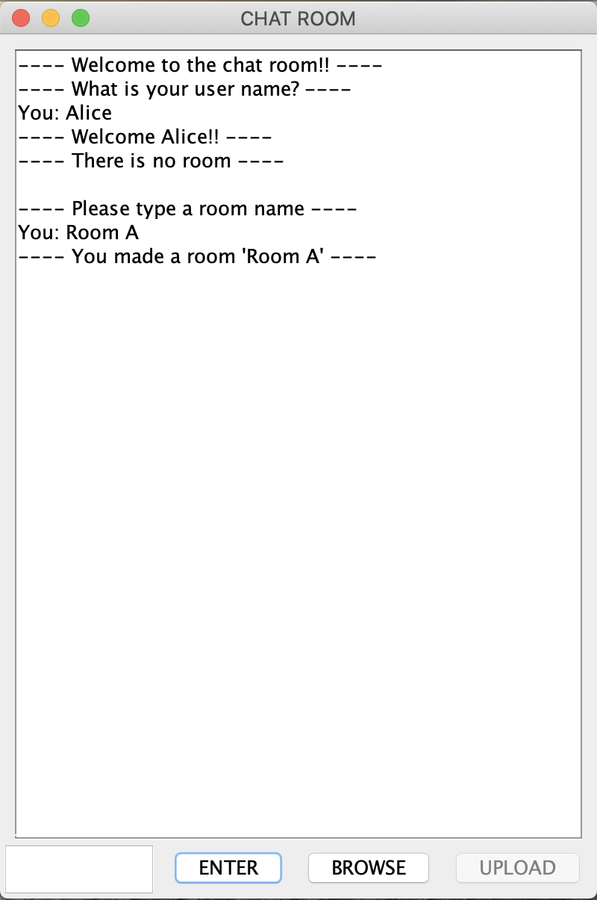
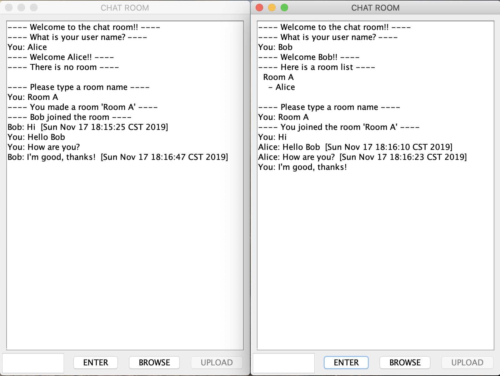
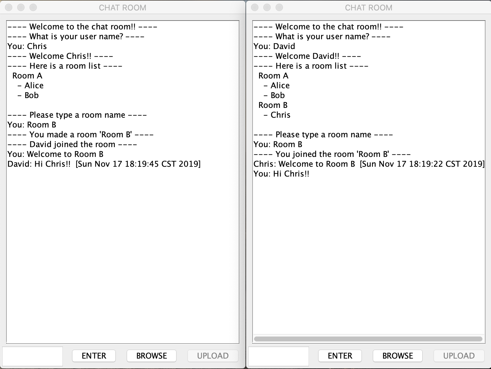
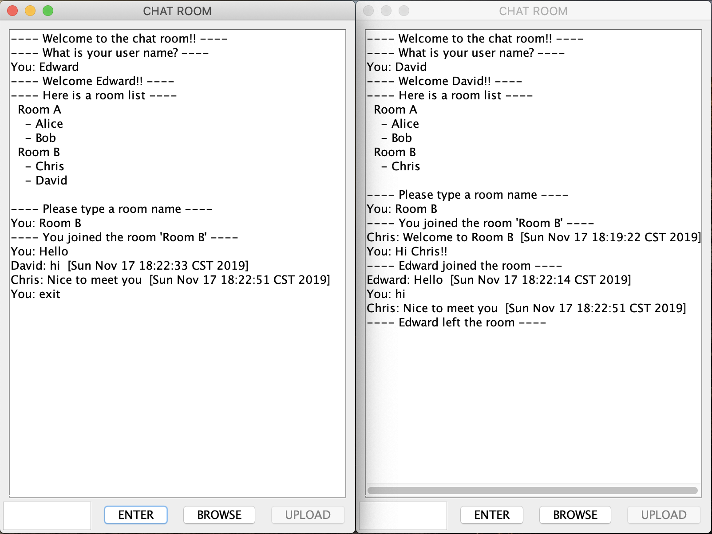
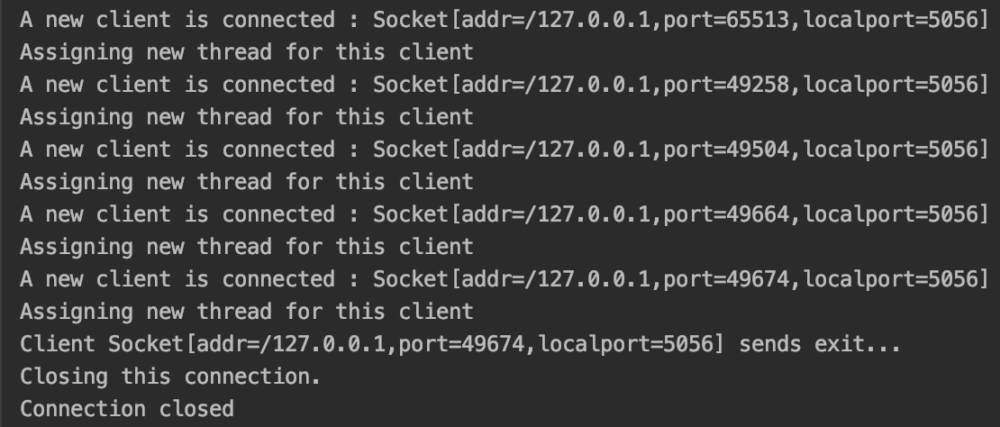
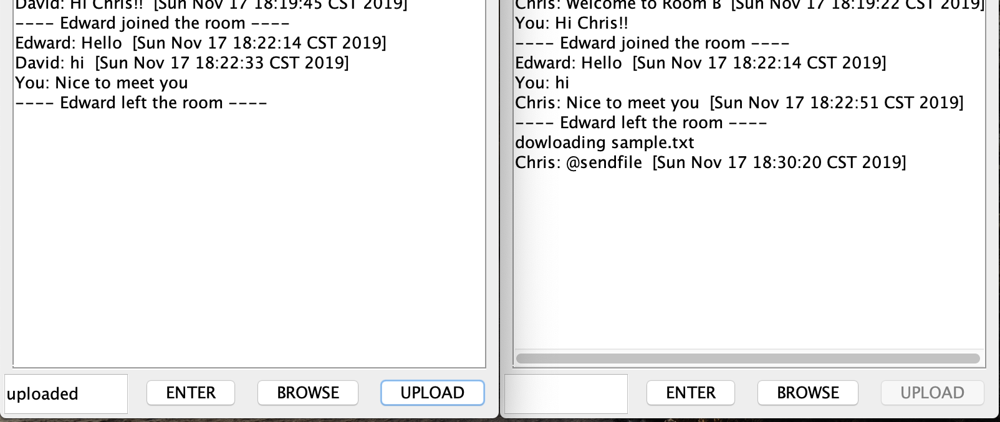

# Chat Room

## Project Overview
As a computer networks group project, we choose Option Ⅲ Program a Networking Application and designed and implemented a chat room server and a GUI interface that displays messages and functions. The chat server makes users send and receive messages with each other. It deals with multiple clients with several rooms such that users can create a group and chat with other users who are in the same room. Moreover, we try to implement the file transfer function.

## Design and Function
### Application Structure
- SERVER
    - Server.java
        - Main server program 
        - Defines a socket
        - Waits for connection and accepts 
    - User.java
        - Creates multiple threads for accepting several clients
    - Room.java
        - Makes a structure that stores the information of each room      
- CLIENT
    - Client.java
        - Receives and sends a message to the Server
        - Supports for the GUI interface
  
### Features and demonstrations
#### Join the chat server and Create a room
After executing the server.java and client.java, the GUI interface shows up. You can type on the text field below and send by clicking the button ENTER. 
First you type your user name and create a room if there is not one.

#### Join a room
Users in the same room can communicate with each other.

#### Create multiple chat rooms in the serer
The server is able to have multiple chat rooms.

#### Close the connection
When you type exit, you leave the room and close the connection.

#### Send a file
By clicking BROWSE, choosing a file from your computer and clicking UPLOAD to submit, you can send a file. User can send text file only in this program and it has some minor issue. Regarding the detail of the issue, we talk on the [Reflection](#Reflection) section.

  
## Reflection
This program works correctly and the GUI interface properly displays what clients do in terms of joining a chat server, entering their names, creating and joining a room, sending and receiving a message, exiting the server. 
However, it has some bugs on the file transfer function. The problem is after a user sends a text file to members in a room, the user cannot send a further message to them. 
We suppose the implementation of the file transfer function was the most difficult part of our project. While because of the time limitation, we have to stop implementing for now for the submission, we want to make it improve and add other features such as a Like button sooner or later.

## Weekly Report Summary
### Week 1
- Programming environment
    - Implement in Java
    - Use GitHub to share codes
- A plan for the project
    1. Extend the socket api communicate with multiple clients within one computer
    2. Make it run in multiple computers
    3. Make it deal with several chat rooms
    4. Create the interface
### Week 2
- Extend a socket API
- Deal with multiple clients
    - Clients join and leave the chat room
    - Clients send messages to each other
### Week 3
- Fix some minor bugs and make it run more smoothly
- Start implementing file transfer function
    - Use java.io in-built functions, including java.io.FileInputStream, java.io.FileOutputStream,  java.io.BufferedInputStream and java.io.BufferedOutputStream
### Week 4
- Implement multiple chat rooms 
    - Users can create a group and join one of them
### Week 5
-  Implement a simple GUI interface 
    - Be able to  send a message through the text field and the enter button  
    - Display what it sent and received
### Week 6
- Work on a file transfer function
- Improve a GUI interface
- Wrap up the project
